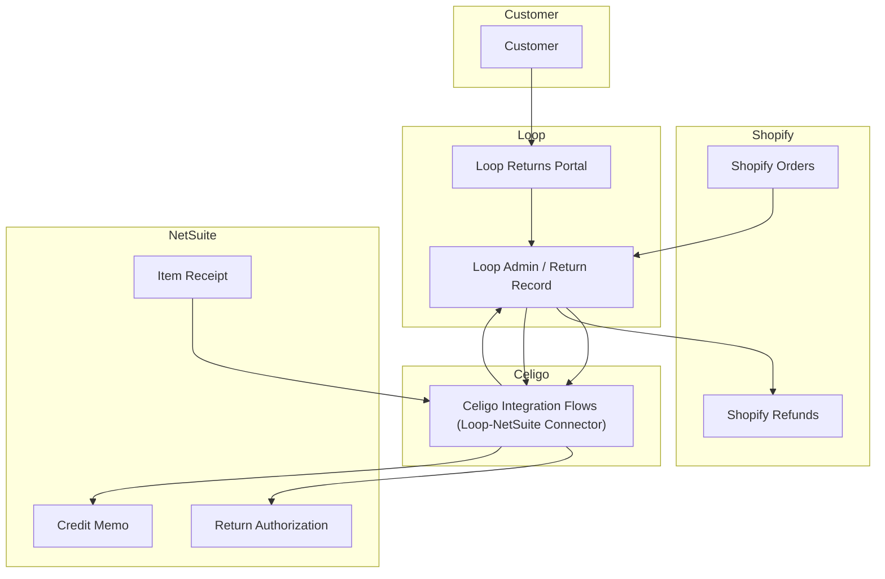

# Integration Architecture

## Systems
- **Shopify**: source of order + executes customer refunds
- **Loop**: return portal + admin return record lifecycle
- **Celigo**: integration layer (Loop–NetSuite connector)
- **NetSuite**: operational + financial system of record (RAs, item receipts, credit memos)

---

## Architecture diagram

> **Note:** This diagram represents the high-level system interactions. Detailed field mappings and Celigo flow configurations were refined iteratively through testing, SME validation, and cross-functional collaboration rather than rigid upfront specifications.
