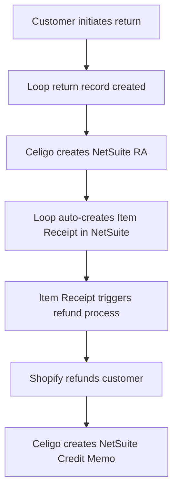
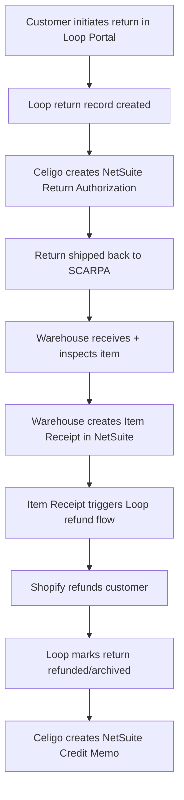
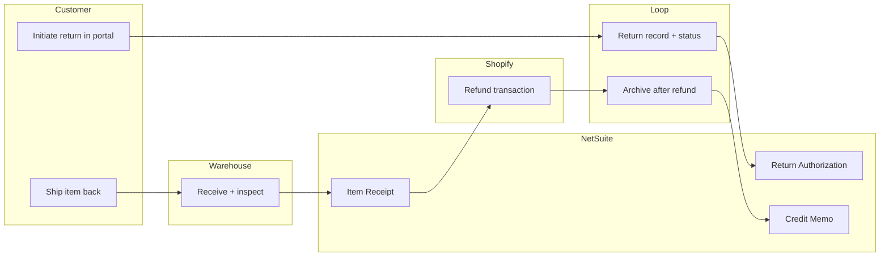
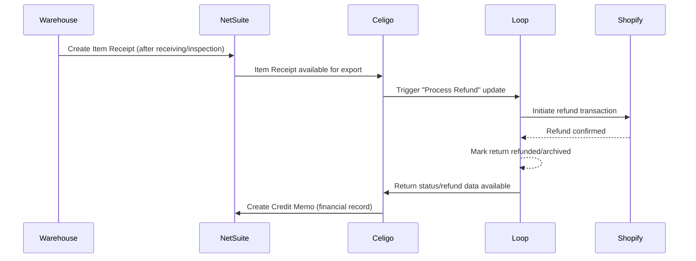

# Process Flows

## Intended (out-of-the-box) Loop workflow

## SCARPA workflow (customized for operational control)

> Key change: Item Receipts are not auto-created. Warehouse receives/inspects and creates the NetSuite Item Receipt.

## Swimlane view (who does what)

## Refund → Credit Memo sequence (timing + dependencies)

